    
# Nsp Oec Training Chapter 20 

## National Ski Patrol - Outdoor Emergency Care chapter 20

    

    
## Table of Contents

- [Solution Overview](#solution-overview)
- [Who will use this ?](#who-can-use)
- [Advantages of Using](#advantages-of-using)
- [Return on Investment (ROI)](#return-on-investment-roi)
- [How it Works](#how-it-works)
- [Conclusion](#conclusion)
- [Getting Started](#getting-started)
- [Solution Features](#solution-features)
- [Code Features](#code-features)
- [Deliverables or Figures](#deliverables-or-figures)
- [Contact Information](#contact-information)

## Chapter 20: Musculoskeletal Injuries

1. Identify and define the functions of the musculoskeletal structures.
2. Describe how musculoskeletal tissues heal.
3. Explain the difference between a sprain and a strain.
4. Describe and demonstrate the general assessment of musculoskeletal injuries.
5. List the signs and symptoms of sprains, strains, ruptured tendons, dislocations, and fractures.
6. Describe and demonstrate how to assess injuries in the following parts of the body (upper and lower extremities). 
7. Explain the general management of a patient with a musculoskeletal injury.
8. List and demonstrate the use of different types of splints. 
9. Explain the difference between traction and tension.
10. Discuss the general principles of splinting.
11. Demonstrate how to care for an injured extremity when there is neurovascular compromise.
12. Demonstrate how to care for the following injuries (upper and lower extremities). 
13. Define and demonstrate the proper care for an open (compound) fracture.
14. Demonstrate how to remove a ski boot, hiking boot, or snowboard boot when patient has an injury to that leg.

## 20.1. Identify and define the functions of the musculoskeletal structures.

The **musculoskeletal system** includes **bones, muscles, joints, tendons, ligaments**, and other connective tissues. This system provides **structure, support, movement**, and **protection** to the human body. Below are the key musculoskeletal structures and their functions:

### **1. Bones**:
   - **Function**: Bones provide the framework for the body, protect internal organs, store minerals (like calcium and phosphorus), and produce blood cells within the bone marrow (hematopoiesis).
   - **Example**: The **skull** protects the brain, and the **ribcage** shields the heart and lungs.

### **2. Muscles**:
   - **Function**: Muscles generate force and allow for movement by contracting and relaxing. They also help maintain posture and produce heat during physical activity.
   - **Types of muscles**:
     - **Skeletal muscles**: Voluntary muscles attached to bones that control movements like walking or lifting.
     - **Smooth muscles**: Involuntary muscles found in organs like the stomach and intestines, controlling functions like digestion.
     - **Cardiac muscles**: Involuntary muscles in the heart that pump blood throughout the body.
   
### **3. Joints**:
   - **Function**: Joints are the places where two or more bones meet, allowing for movement and flexibility. The range of motion varies depending on the type of joint.
   - **Types of joints**:
     - **Hinge joints** (e.g., elbow, knee) allow movement in one direction (flexion and extension).
     - **Ball-and-socket joints** (e.g., shoulder, hip) allow rotational movement and movement in multiple planes.
     - **Pivot joints** (e.g., neck) allow rotation around a single axis.
     - **Gliding joints** (e.g., wrists and ankles) allow bones to glide over one another.

### **4. Tendons**:
   - **Function**: Tendons connect **muscles to bones**. They transmit the force generated by muscles to bones, facilitating movement.
   - **Example**: The **Achilles tendon** connects the calf muscle to the heel bone, enabling walking and running.

### **5. Ligaments**:
   - **Function**: Ligaments connect **bones to other bones**, providing stability to joints and preventing excessive movement.
   - **Example**: The **anterior cruciate ligament (ACL)** in the knee helps stabilize the joint during movement.

### **6. Cartilage**:
   - **Function**: Cartilage is a flexible, rubbery tissue that cushions joints, reduces friction between bones, and provides structure in certain parts of the body.
   - **Types of cartilage**:
     - **Hyaline cartilage**: Found in joints, it allows for smooth movement and reduces friction.
     - **Fibrocartilage**: Found in intervertebral discs, it provides shock absorption.
     - **Elastic cartilage**: Found in the ear and epiglottis, it provides flexibility and support.

### **7. Fascia**:
   - **Function**: Fascia is a connective tissue that surrounds muscles, bones, nerves, and blood vessels. It supports and binds different parts of the musculoskeletal system, helping with movement and stability.

### **8. Bursae**:
   - **Function**: Bursae are small fluid-filled sacs that reduce friction between bones, tendons, and muscles around joints, especially in areas with frequent movement, like the shoulders and knees.

---

### **Summary of Functions**:
- **Support and Structure**: Bones provide the body’s framework, and muscles help maintain posture.
- **Movement**: Muscles contract to move bones at joints, with tendons and ligaments providing stability and force transmission.
- **Protection**: Bones protect vital organs (e.g., the skull protects the brain).
- **Cushioning and Shock Absorption**: Cartilage, bursae, and intervertebral discs cushion bones and reduce friction during movement.
- **Stability**: Ligaments stabilize joints, while tendons anchor muscles to bones for effective movement.

Each of these structures works together to allow the body to move, maintain stability, and protect vital organs.

## 20.2. Describe how musculoskeletal tissues heal.

The healing process for **musculoskeletal tissues**—including **bones, muscles, tendons, ligaments**, and **cartilage**—involves several stages. Each tissue type heals differently based on its structure and blood supply. Below is a general overview of how these tissues heal:

### **1. Bone Healing**:
Bones have an excellent blood supply, which allows them to heal relatively well. The process of bone healing typically follows these stages:

#### **Stages of Bone Healing**:
1. **Inflammation Stage** (0-1 week):
   - **Injury**: A fracture causes bleeding and the formation of a **hematoma** (blood clot) around the break. This clot contains inflammatory cells that remove debris and dead bone tissue.
   - **Inflammatory response**: The body sends specialized cells to the site to clean up and signal the repair process to begin.

2. **Soft Callus Formation** (1-3 weeks):
   - **Fibrocartilage callus**: A **soft callus** made of cartilage and fibrous tissue begins to bridge the gap between the broken bone ends. This provides early stabilization but is still soft and weak.
   
3. **Hard Callus Formation** (3-8 weeks):
   - **Bone formation**: The soft callus is replaced by a **hard callus**, which is made of woven bone. This callus begins to solidify and provides greater stability to the fracture site.

4. **Bone Remodeling** (8 weeks-1 year+):
   - **Remodeling**: Over time, the hard callus is gradually replaced by **lamellar bone**, which is stronger and more organized. The bone continues to reshape and regain its original strength and function.

#### Factors Affecting Bone Healing:
- **Adequate blood supply**, **age**, and **nutrition** (e.g., calcium, vitamin D) can affect the rate of bone healing.
- **Immobilization** and **reduction** of the fracture (e.g., casting or surgery) are necessary to ensure proper alignment and healing.

---

### **2. Muscle Healing**:
Muscles have a good blood supply, which allows them to heal efficiently, though the process can vary depending on the severity of the injury.

#### **Stages of Muscle Healing**:
1. **Inflammation Stage** (1-3 days):
   - **Injury**: A muscle tear or strain triggers bleeding and an inflammatory response.
   - **Inflammatory cells** clear out dead or damaged muscle fibers.

2. **Repair and Regeneration Stage** (3 days-3 weeks):
   - **Satellite cells**, a type of stem cell, become activated and help regenerate new muscle fibers to replace the damaged tissue.
   - **Scar tissue** (collagen) forms to stabilize the area, but it can reduce muscle elasticity.

3. **Remodeling Stage** (3 weeks-6 months):
   - New muscle fibers and scar tissue are remodeled to restore muscle function and strength. Physical therapy and exercise play a key role in this stage to rebuild strength and flexibility.

#### Factors Affecting Muscle Healing:
- **Severity of the injury**: Minor strains heal faster than complete tears.
- **Early mobilization**: Proper exercise and stretching can help remodel muscle fibers and prevent stiffness or weakness.

---

### **3. Tendon and Ligament Healing**:
Tendons and ligaments have a **poor blood supply**, which slows their healing process compared to bones and muscles.

#### **Stages of Tendon/Ligament Healing**:
1. **Inflammation Stage** (0-7 days):
   - Similar to other tissues, tendons and ligaments experience inflammation and an influx of cells to clean up debris and signal repair.

2. **Proliferation Stage** (1-6 weeks):
   - **Fibroblasts** (cells that produce collagen) begin to form new collagen fibers to bridge the gap. However, the new tissue is disorganized and weak.

3. **Maturation and Remodeling Stage** (6 weeks-1 year+):
   - The collagen fibers gradually align and strengthen to restore function, but tendons and ligaments rarely regain their full pre-injury strength.
   - Full return to function can take several months or even a year, and scar tissue can form, leading to reduced flexibility.

#### Factors Affecting Tendon/Ligament Healing:
- **Immobilization**: Tendons and ligaments need to be immobilized early to avoid re-injury, but controlled movement later in healing promotes proper fiber alignment.
- **Rehabilitation exercises**: These help restore strength and flexibility over time.

---

### **4. Cartilage Healing**:
Cartilage has very limited healing capacity due to its **poor blood supply**. Healing is slow and often incomplete.

#### **Stages of Cartilage Healing**:
- **Minor injuries**: May heal slowly through diffusion of nutrients from surrounding tissues, but often leave the cartilage weakened.
- **Major injuries**: Cartilage damage (e.g., in the knee or hip) may not heal on its own, often requiring **surgical interventions** like **microfracture surgery** or **cartilage transplantation** to stimulate new tissue growth.

#### Factors Affecting Cartilage Healing:
- **Blood supply**: Because cartilage lacks blood vessels, its healing is slow and limited.
- **Interventions**: Surgery or stem cell therapy may be required for full recovery in major injuries.

---

### **5. Healing of Other Connective Tissues (Fascia and Bursae)**:
- **Fascia**: Heals similarly to tendons and ligaments, involving inflammation, collagen production, and remodeling.
- **Bursae**: Inflamed bursae (bursitis) often require rest and anti-inflammatory treatments. If the condition is chronic, medical intervention, such as aspiration or surgery, may be needed.

---

### **Summary of Musculoskeletal Healing**:
- **Bones**: Heal through stages of inflammation, callus formation, and remodeling, usually regaining full strength.
- **Muscles**: Heal with new muscle fibers and scar tissue formation, but rehabilitation is key to restoring function.
- **Tendons and Ligaments**: Heal slowly and often incompletely, requiring immobilization followed by controlled movement for proper recovery.
- **Cartilage**: Has very limited healing capacity, often requiring medical interventions for repair.
- **Other Connective Tissues**: Fascia and bursae heal similarly to tendons, with treatment focusing on inflammation control and proper rest.

Each type of musculoskeletal tissue has unique healing properties, and factors like blood supply, severity of injury, and rehabilitation play a significant role in recovery.

## 20.3. Explain the difference between a sprain and a strain.

The main difference between a **sprain** and a **strain** lies in the type of tissue affected and the nature of the injury:

### **Sprain**:
- **Definition**: A sprain is an injury to a **ligament**, which is the tough, fibrous tissue that connects **bones to other bones** at a joint.
- **Cause**: Sprains occur when a ligament is **stretched or torn** due to excessive force applied to a joint, such as twisting, falling, or impact.
- **Common Locations**:
  - **Ankle** (most common)
  - **Wrist**
  - **Knee**
  - **Thumb**
- **Symptoms**:
  - Pain
  - Swelling
  - Bruising
  - Limited ability to move the joint
  - A "popping" sensation may occur at the time of injury.
  
### **Strain**:
- **Definition**: A strain is an injury to a **muscle** or **tendon**, the tissue that connects **muscles to bones**.
- **Cause**: Strains occur when a muscle or tendon is **stretched or torn**, often due to overuse, overstretching, or excessive force.
- **Common Locations**:
  - **Lower back**
  - **Hamstrings**
  - **Shoulder**
  - **Calf**
- **Symptoms**:
  - Pain
  - Muscle spasms or cramping
  - Swelling
  - Muscle weakness
  - Limited range of motion
  
### **Key Differences**:
- **Tissue affected**: 
  - A sprain affects **ligaments** (bone-to-bone connections).
  - A strain affects **muscles or tendons** (muscle-to-bone connections).
  
- **Common cause**:
  - Sprains are usually caused by a **sudden twist or impact** to a joint.
  - Strains are often caused by **overstretching** or **overuse** of a muscle or tendon.

---

### **Treatment**:
Both sprains and strains are treated with the **R.I.C.E.** method:
- **Rest**: Avoid using the injured area to allow it to heal.
- **Ice**: Apply ice to reduce swelling and pain.
- **Compression**: Use a compression bandage to limit swelling.
- **Elevation**: Elevate the injured area to reduce swelling.

In more severe cases, physical therapy or surgery may be required. Both injuries benefit from proper rehabilitation to restore full strength and flexibility.

## 20.4. Describe and demonstrate the general assessment of musculoskeletal injuries.

### **General Assessment of Musculoskeletal Injuries**:

Assessing musculoskeletal injuries involves a systematic approach to determine the severity of the injury, identify any underlying damage, and decide on the necessary treatment. The general assessment includes **history taking**, **physical examination**, and **specific tests**.

Here’s how to assess musculoskeletal injuries step-by-step:

---

### **1. Scene Safety and Initial Approach**:
   - **Ensure the environment is safe** for both you and the patient before proceeding.
   - Approach the patient and offer **reassurance**.

### **2. History Taking**:
   - Ask the patient to describe the **mechanism of injury**:
     - **What happened?** (e.g., fall, twisting motion, direct impact)
     - **When did it occur?**
   - Assess **pain**:
     - Where is the pain located?
     - On a scale of 0-10, how severe is the pain?
     - What type of pain is it? (sharp, dull, throbbing, etc.)
   - Ask about **prior injuries** to the area or pre-existing conditions.
   - Determine if the patient has heard any **"popping" or "cracking" sounds**, which could indicate ligament tears or fractures.

### **3. Inspection (Look)**:
   - Visually inspect the injured area for:
     - **Swelling**: Can indicate tissue damage or internal bleeding.
     - **Bruising (Ecchymosis)**: Often a sign of trauma, strain, or sprain.
     - **Deformity**: Could indicate a fracture, dislocation, or severe soft tissue injury.
     - **Open Wounds**: Look for any signs of **open fractures** or skin damage.
   - **Symmetry**: Compare the injured area to the uninjured side to detect differences in shape, alignment, or size.

### **4. Palpation (Feel)**:
   - **Gently palpate** (touch) the injured area, starting **away from the site of injury** and moving toward it:
     - **Point tenderness**: Localized pain when touched may indicate fractures or soft tissue injuries.
     - **Warmth or heat**: Could indicate inflammation or infection.
     - **Crepitus**: A grating or crackling sensation under the skin may suggest a bone fracture.
     - **Swelling**: Feel for the extent of swelling in the area.

### **5. Range of Motion (Move)**:
   - **Active range of motion**: Ask the patient to move the injured limb or joint if possible.
     - **Pain** or inability to move could indicate a fracture, sprain, or severe muscle strain.
   - **Passive range of motion**: Gently move the affected limb for the patient, stopping if they experience pain. This helps evaluate joint stability.
   - Look for **abnormal movement**: This may indicate joint dislocation or ligament injury.
   
### **6. Neurovascular Assessment**:
   Assess **circulation, sensation, and movement (CSM)** to ensure blood flow and nerve function are intact:
   - **Circulation**:
     - Check for a **pulse** distal (further from the heart) to the injury (e.g., the radial pulse for arm injuries, dorsalis pedis pulse for leg injuries).
     - Assess **capillary refill** by pressing on the fingernails or toenails and noting how long it takes for color to return (should be less than 2 seconds).
   - **Sensation**:
     - Ask the patient if they can feel you touching different parts of the injured area. Loss of sensation may indicate nerve damage.
     - Check for **numbness or tingling** (paresthesia), which could indicate a nerve injury.
   - **Movement**:
     - Ask the patient to **wiggle their fingers or toes**.
     - Assess the ability to move the limb **below the site of injury** to rule out nerve or tendon injury.

### **7. Specific Tests** (if applicable):
   - **Squeeze test**: Gently squeeze the area around the suspected fracture or sprain. If pain increases, it may indicate a fracture or soft tissue injury.
   - **Tuning fork test**: A vibrating tuning fork applied near the injury may amplify pain if a fracture is present.
   - **Stress tests**: For joint injuries, gently stress the ligaments to check for **instability** or **laxity**, which may indicate a sprain.

---

### **Demonstration Example**:

#### **Scenario**: Suspected ankle sprain from a fall during sports.

1. **Scene Safety**: Ensure no further hazards in the area (e.g., sports equipment).
   
2. **History Taking**:
   - **Mechanism of injury**: The patient explains that they twisted their ankle while landing awkwardly during a jump.
   - **Pain**: The patient reports moderate pain on the outer side of the ankle.

3. **Inspection**:
   - You observe **swelling** and **bruising** around the outer ankle, with no obvious deformity.

4. **Palpation**:
   - You gently palpate the ankle and find **tenderness** over the lateral ligaments but no significant pain over the bones.

5. **Range of Motion**:
   - The patient can slightly move their foot up and down but experiences **pain with sideways movements**, indicating a possible ligament sprain.

6. **Neurovascular Assessment**:
   - You check the **dorsalis pedis pulse** (normal), assess **capillary refill** in the toes (normal), and confirm that the patient can feel and move their toes, ruling out nerve damage.

7. **Specific Tests**:
   - A gentle **squeeze test** elicits discomfort over the ligaments, further suggesting a sprain rather than a fracture.

---

### **8. Initial Management**:
Based on the assessment, you may proceed with:
- **R.I.C.E. (Rest, Ice, Compression, Elevation)** for the sprained ankle.
- **Immobilization** with a brace or splint if necessary.
- Referral for **X-ray** or further medical evaluation if a fracture or significant ligament injury is suspected.

---

### **Key Points to Remember**:
- **Look** for visual signs like swelling, bruising, or deformity.
- **Feel** for tenderness, warmth, or crepitus.
- **Move** the injured area to assess function, but stop if pain occurs.
- Always assess **circulation, sensation, and movement** to ensure no nerve or vascular damage.

## 20.5. List the signs and symptoms of sprains, strains, ruptured tendons, dislocations, and fractures.

Here’s a detailed list of the **signs and symptoms** for each type of musculoskeletal injury:

---

### **1. Sprains** (Injury to ligaments):
- **Pain**: Varies from mild to severe, depending on the degree of ligament injury.
- **Swelling**: Rapid swelling around the affected joint.
- **Bruising (Ecchymosis)**: Discoloration around the joint, which can develop over time.
- **Limited Range of Motion**: Difficulty moving the joint due to pain and swelling.
- **Instability**: The joint may feel weak or unstable, especially in severe sprains.
- **Popping Sensation**: Some individuals report hearing or feeling a "pop" at the moment of injury, indicating a ligament tear.

#### **Common Locations**:
- Ankle, knee, wrist, and thumb.

---

### **2. Strains** (Injury to muscles or tendons):
- **Pain**: Localized pain that worsens with movement or muscle use.
- **Muscle Spasms**: Involuntary tightening or cramping of the muscle.
- **Swelling**: Mild swelling around the affected muscle or tendon.
- **Muscle Weakness**: Difficulty using the affected muscle, leading to weakness or reduced function.
- **Bruising**: Discoloration around the affected area, especially in more severe strains.
- **Stiffness**: Limited ability to move the affected muscle, often due to pain and swelling.

#### **Common Locations**:
- Lower back, hamstrings, shoulder, and calf.

---

### **3. Ruptured Tendons** (Complete tear of a tendon):
- **Severe Pain**: Sudden, sharp pain at the site of the rupture.
- **Immediate Weakness or Loss of Function**: Inability to move the affected body part. For example, a ruptured Achilles tendon may prevent you from pushing off the ground when walking.
- **Popping or Snapping Sound**: Many patients describe hearing a "pop" or "snap" at the time of injury.
- **Swelling**: Rapid swelling and sometimes bruising around the injury site.
- **Deformity**: Visible deformity or a gap where the tendon should be (e.g., a lump near the knee in the case of a quadriceps tendon rupture).
- **Limited Range of Motion**: Complete loss of function in the affected tendon.

#### **Common Locations**:
- Achilles tendon, biceps tendon, rotator cuff, patellar tendon.

---

### **4. Dislocations** (Displacement of a bone from its normal position in a joint):
- **Severe Pain**: Intense pain at the joint, especially with movement.
- **Deformity**: The joint appears visibly out of place or misshapen.
- **Swelling**: Rapid swelling around the joint.
- **Limited or Inability to Move the Joint**: Movement is extremely painful or impossible.
- **Bruising**: Discoloration around the affected joint as swelling increases.
- **Numbness or Tingling**: Nerve damage due to the dislocation can cause tingling or numbness in the area.
- **Instability**: The joint may feel unstable or "loose" after the injury.

#### **Common Locations**:
- Shoulder, elbow, knee, finger, and hip.

---

### **5. Fractures** (Broken bones):
- **Severe Pain**: Immediate, sharp pain at the site of the fracture.
- **Swelling**: Significant swelling around the fracture site.
- **Bruising**: Skin discoloration around the fracture due to internal bleeding.
- **Deformity**: The limb may appear out of alignment or have an abnormal shape.
- **Inability to Move**: Difficulty or inability to move the affected limb due to pain and bone instability.
- **Crepitus**: A grating or crackling sensation or sound when the fractured ends of the bone rub together.
- **Numbness**: Numbness or tingling may occur if nerves are damaged or compressed by the fractured bone.

#### **Common Locations**:
- Arms, legs, ribs, and collarbone.

---

### **Summary of Signs and Symptoms by Injury**:

| **Injury Type**        | **Key Symptoms**                                                                                     |
|------------------------|-----------------------------------------------------------------------------------------------------|
| **Sprains**             | Pain, swelling, bruising, limited motion, joint instability, possible "pop" sound                   |
| **Strains**             | Pain, swelling, muscle spasms, weakness, stiffness, bruising                                        |
| **Ruptured Tendons**    | Sudden sharp pain, loss of function, popping sound, swelling, deformity, limited range of motion     |
| **Dislocations**        | Severe pain, deformity, inability to move joint, swelling, bruising, numbness, joint instability     |
| **Fractures**           | Intense pain, swelling, bruising, deformity, crepitus, numbness, inability to move, possible bone protrusion in open fractures |

Each type of injury requires proper assessment and often medical intervention, including immobilization, rehabilitation, or surgery, depending on severity.

## 20.6. Describe and demonstrate how to assess injuries in the following parts of the body (upper and lower extremities). 

### **Assessing Injuries in the Upper and Lower Extremities**

When assessing injuries to the **upper and lower extremities** (arms and legs), it is essential to follow a systematic approach that includes history taking, physical examination, and functional tests. The primary goal is to identify the severity of the injury, assess for fractures, sprains, strains, or dislocations, and check for any vascular or neurological compromise.

### **General Steps for Assessment**:
1. **History Taking**:
   - Ask the patient how the injury occurred (mechanism of injury).
   - Determine the **location** and **intensity** of the pain.
   - Ask if they heard any **popping or snapping sounds** at the time of injury.
   - Assess for **previous injuries** or medical conditions that may affect healing.

2. **Physical Examination** (Look, Feel, Move):
   - **Inspection (Look)**: Observe for swelling, bruising, deformity, or open wounds.
   - **Palpation (Feel)**: Gently feel the injured area to check for tenderness, deformities, or crepitus (a grating sound).
   - **Range of Motion (Move)**: Assess the patient's ability to move the affected limb, noting any pain or limitations.

3. **Neurovascular Check**:
   - Ensure that blood flow (circulation) and nerve function (sensation and movement) are intact.
   - Check **capillary refill**, pulses, and sensations in the fingers or toes.

### **Assessing Upper Extremity Injuries**:
The **upper extremities** include the shoulders, arms, elbows, wrists, and hands.

#### **1. Shoulder Injury Assessment**:
- **Inspection**: Look for obvious deformities or dislocation (the shoulder may look lower than the uninjured side).
- **Palpation**: Gently palpate the **clavicle**, **scapula**, and **shoulder joint** for tenderness or deformity.
- **Range of Motion**: Ask the patient to move their shoulder in different directions:
  - **Abduction** (raise arm to the side).
  - **Flexion and extension** (raise arm forward and backward).
  - **Internal and external rotation** (turn arm inward and outward).
  - Pain during these movements may suggest a **rotator cuff tear**, **dislocation**, or **fracture**.

#### **2. Elbow Injury Assessment**:
- **Inspection**: Look for **swelling, deformity**, or signs of dislocation.
- **Palpation**: Feel for tenderness at the **olecranon process** (tip of the elbow) or the **lateral/medial epicondyles** (sides of the elbow).
- **Range of Motion**: Ask the patient to:
  - **Bend** (flexion) and **straighten** (extension) the elbow.
  - **Rotate** the forearm (pronation and supination).
  - Inability to perform these movements may indicate a **fracture, ligament sprain**, or **dislocation**.

#### **3. Wrist and Hand Injury Assessment**:
- **Inspection**: Look for **swelling**, bruising, and any obvious deformity in the wrist or fingers.
- **Palpation**: Gently press along the **radius and ulna** (bones of the forearm) and the **wrist bones** (carpals). Check the **metacarpals** and **phalanges** for tenderness.
- **Range of Motion**:
  - **Wrist flexion and extension**: Ask the patient to bend and straighten the wrist.
  - **Finger flexion and extension**: Ask the patient to open and close their fingers.
  - **Grip strength**: Have the patient squeeze your fingers or an object.
  - Pain, weakness, or limited motion may indicate a **wrist sprain, fracture**, or **tendon injury**.

#### **Neurovascular Check for Upper Extremity**:
- **Sensation**: Check the patient's ability to feel light touch in the **fingers** and **hand**.
- **Circulation**: Check the **radial pulse** and observe **capillary refill** (should be less than 2 seconds).

---

### **Assessing Lower Extremity Injuries**:
The **lower extremities** include the hips, thighs, knees, ankles, and feet.

#### **1. Hip and Pelvis Injury Assessment**:
- **Inspection**: Look for **shortening** of the affected leg or external rotation, which may indicate a **fracture** or **dislocation**.
- **Palpation**: Feel for tenderness in the **pelvic bones** and the **hip joint**.
- **Range of Motion**: Ask the patient to:
  - **Flex** the hip (raise leg upward).
  - **Abduct** and **adduct** the leg (move the leg sideways and inward).
  - **Rotate** the leg internally and externally.
  - Pain or inability to move the hip may indicate a **fracture, dislocation**, or **muscle strain**.

#### **2. Knee Injury Assessment**:
- **Inspection**: Look for swelling, deformity, or a **popping sound** at the time of injury (common in ligament tears).
- **Palpation**: Gently palpate the **patella (kneecap)**, **joint line**, and **ligaments** for tenderness or swelling.
- **Range of Motion**:
  - **Flexion and extension**: Ask the patient to bend and straighten the knee.
  - Pain or limited movement may suggest a **ligament tear, meniscus injury**, or **fracture**.

#### **3. Ankle and Foot Injury Assessment**:
- **Inspection**: Look for **swelling**, bruising, or deformity around the ankle or foot.
- **Palpation**: Gently feel along the **ankle bones** (malleoli) and **metatarsals** (foot bones) for tenderness.
- **Range of Motion**:
  - **Ankle dorsiflexion and plantarflexion**: Ask the patient to point their toes up and down.
  - **Inversion and eversion**: Ask the patient to move their foot inward and outward.
  - Pain with these movements may indicate a **sprain, fracture**, or **ligament tear**.
  
#### **Neurovascular Check for Lower Extremity**:
- **Sensation**: Check for feeling in the **toes** and **foot**.
- **Circulation**: Check the **dorsalis pedis pulse** or **posterior tibial pulse** and assess **capillary refill** in the toes.

---

### **Demonstration Example**:

#### **Scenario**: Assessing an ankle injury from a fall.
1. **Inspection**: Observe the ankle for swelling and bruising on the outer side, but no obvious deformity.
2. **Palpation**: Gently feel the lateral malleolus (outer ankle bone) and notice tenderness. The metatarsals and Achilles tendon feel normal.
3. **Range of Motion**:
   - The patient has **limited plantarflexion** (pointing toes downward) due to pain, but can slightly move the ankle upward (dorsiflexion).
   - Inversion (moving foot inward) causes sharp pain.
4. **Neurovascular Check**:
   - Capillary refill is **normal** in the toes, and the **dorsalis pedis pulse** is strong. The patient can feel light touch in the foot.

#### **Conclusion**: This suggests a **sprain** of the lateral ankle ligaments, requiring **R.I.C.E. (Rest, Ice, Compression, Elevation)** and possible referral for X-rays to rule out a fracture.

---

### **Key Points**:
- Assess **mechanism of injury**, inspect for **swelling, deformity**, and test **range of motion**.
- **Palpate** the affected area gently to locate tenderness or deformities.
- Always perform a **neurovascular check** to assess circulation and nerve function.
- Use specific movement tests to assess for ligament, tendon, or bone injuries.

## 20.7. Explain the general management of a patient with a musculoskeletal injury.

The **general management** of a patient with a musculoskeletal injury aims to reduce pain, prevent further injury, and promote healing. It involves **initial first aid**, stabilizing the injury, and providing appropriate care until the patient can be evaluated and treated by a healthcare professional. Here’s a step-by-step guide to managing musculoskeletal injuries:

---

### **1. Scene Safety and Initial Assessment**:
- **Ensure Scene Safety**: Before approaching the patient, ensure that the environment is safe for you and the patient (e.g., remove hazards, stop activities if needed).
- **Primary Survey**: Quickly assess the patient for **life-threatening conditions** (ABC: Airway, Breathing, Circulation) before addressing the musculoskeletal injury.
- **Secondary Survey**: Focus on the injury, identifying the type of injury (e.g., fracture, sprain, strain) through **visual inspection** and gentle **palpation**.

---

### **2. Immobilization and Stabilization**:
The goal of immobilization is to prevent further damage to the injured area and reduce pain.

#### **A. Splinting**:
- **Purpose**: Immobilize the injured bone or joint to prevent movement and reduce pain.
- **Types of Splints**:
  - **Rigid splints**: Can be made from materials like wood, metal, or plastic.
  - **Soft splints**: Made from materials like pillows, folded blankets, or a sling.
  - **Anatomic splints**: Using the patient’s body as a splint (e.g., taping an injured finger to an adjacent finger).

#### **Steps to Apply a Splint**:
1. **Support the injured area**: Have someone stabilize the injured part while you apply the splint.
2. **Check circulation**: Before splinting, check **circulation, sensation, and movement** (CSM) to ensure blood flow and nerve function are intact. Check for **capillary refill** and distal **pulse**.
3. **Apply the splint**: Immobilize the joints **above and below** the injury. For example, if the forearm is fractured, immobilize both the wrist and elbow.
4. **Secure the splint**: Use bandages, cloth, or tape to secure the splint without applying excessive pressure.
5. **Recheck circulation**: After splinting, recheck CSM to ensure blood flow is not compromised.

---

### **3. Pain Control**:
Musculoskeletal injuries can cause significant pain, and managing pain is crucial for the patient’s comfort.

- **R.I.C.E. Method** (for strains, sprains, and minor fractures):
  - **Rest**: Advise the patient to rest the injured part and avoid using it.
  - **Ice**: Apply an **ice pack** (wrapped in a cloth) for 15-20 minutes every hour to reduce swelling and numb the area.
  - **Compression**: Use an **elastic bandage** to apply gentle compression to reduce swelling. Avoid wrapping too tightly, as it can restrict blood flow.
  - **Elevation**: Elevate the injured part above the level of the heart to help reduce swelling.

- **Pain Relief Medications**:
  - Administer **over-the-counter pain medications** like ibuprofen (for pain and swelling) or acetaminophen (for pain relief) if allowed and appropriate.
  - Avoid giving medications if the patient has contraindications (e.g., allergies, stomach ulcers).

---

### **4. Treating Open Wounds** (if present):
If the musculoskeletal injury involves an **open wound**, manage the wound before focusing on the underlying injury.

- **Control Bleeding**: Apply **direct pressure** with a clean dressing to stop bleeding.
- **Cover the Wound**: Use a **sterile dressing** or bandage to protect the wound from infection.
- **Avoid Moving Impaled Objects**: If an object is embedded in the wound (impaled object), **do not remove it**. Stabilize the object in place and seek immediate medical care.

---

### **5. Monitor for Complications**:
Certain complications can arise with musculoskeletal injuries. It is important to **monitor the patient** for signs of worsening conditions, especially if the injury is severe.

#### **Signs to Watch For**:
- **Compartment Syndrome**: A dangerous condition where swelling causes increased pressure within a muscle compartment, cutting off blood flow and nerve function. Signs include severe pain, swelling, tightness, numbness, and inability to move the affected area.
- **Neurovascular Compromise**: Reduced blood flow or nerve damage to the injured area. Symptoms include numbness, tingling, coldness, or pale skin.
- **Shock**: If the patient has suffered severe trauma (e.g., from a fall or accident), monitor for signs of **shock** (pale skin, rapid breathing, weak pulse, confusion, low blood pressure). Shock requires immediate medical attention.

---

### **6. Seek Professional Medical Help**:
- **Urgent Medical Care**: Serious musculoskeletal injuries (e.g., fractures, dislocations, ruptured tendons) often require **emergency medical attention**.
  - Call **911** or transport the patient to the **nearest hospital** if there is:
    - Obvious deformity or suspected fracture.
    - Severe pain, inability to move the affected part.
    - Loss of circulation or sensation.
    - Signs of infection (for open wounds) or systemic complications (e.g., shock).
  
- **Referral for X-ray or MRI**: Further imaging may be needed to diagnose the extent of the injury, particularly for fractures, ligament tears, or tendon ruptures.

---

### **7. Rehabilitation and Follow-Up**:
Once the injury has been stabilized and treated, rehabilitation is essential for full recovery.

- **Physical Therapy**: After the initial healing phase, **physical therapy** may be required to restore strength, range of motion, and function to the injured area.
- **Gradual Return to Activity**: Advise the patient to gradually return to normal activities under the guidance of a healthcare professional, particularly after significant injuries like fractures or ligament tears.

---

### **Demonstration Example: Managing a Suspected Ankle Sprain**

1. **Scene Safety and Initial Assessment**:
   - You assess the patient, who reports twisting their ankle while running. The patient has pain and swelling around the ankle but can move the toes.
   
2. **Immobilization**:
   - You support the ankle and apply a **soft splint** using a towel or a pillow, securing it with an elastic bandage to prevent movement.
   - You check **circulation and sensation** in the foot by checking for **capillary refill** in the toes and ensuring the patient can still feel light touch.

3. **Pain Control**:
   - You apply an **ice pack** wrapped in cloth for 15 minutes to reduce swelling.
   - You advise the patient to **elevate the leg** and rest.
   - If available and appropriate, administer **ibuprofen** to reduce pain and swelling.

4. **Referral**:
   - Based on your assessment, you suspect a moderate **ankle sprain**. You refer the patient for further evaluation and possibly an X-ray to rule out a fracture.

---

### **Key Points**:
- **Immobilize the injury**: Use splints or braces to prevent further damage.
- **Control pain and swelling**: Apply the R.I.C.E. method (Rest, Ice, Compression, Elevation).
- **Monitor circulation and nerve function**: Regularly check for signs of reduced blood flow or nerve damage.
- **Seek medical help** for serious injuries or complications like fractures, dislocations, or compartment syndrome.
- **Rehabilitation**: Encourage a gradual return to activity with physical therapy for long-term recovery.

This approach ensures that musculoskeletal injuries are managed effectively, reducing the risk of complications and promoting proper healing.

## 20.8. List and demonstrate the use of different types of splints. 

### **Types of Splints and Their Uses**

Splints are used to immobilize an injured limb, prevent further injury, reduce pain, and minimize swelling. There are several types of splints, each suited for specific injuries. Below is a list of common splints and their uses, along with a demonstration of how to apply them.

---

### **1. Rigid Splints**
#### **Description**:
Rigid splints are made from firm materials such as wood, metal, plastic, or commercially manufactured splints. They provide **firm support** and are used to immobilize fractures or dislocations.

#### **Common Use**:
- **Fractures of long bones** (e.g., arm, leg).
- **Dislocations** of joints (e.g., wrist, elbow).

#### **Demonstration (Rigid Splint for Arm Fracture)**:
1. **Support the injured arm** by having the patient hold it still or using someone to stabilize the limb.
2. Place a **rigid splint** (e.g., a board or manufactured splint) along the **underside of the arm**, extending past the elbow and wrist to immobilize both joints.
3. **Pad** the splint with soft material (e.g., cloth or gauze) to make it more comfortable.
4. Secure the splint with **bandages or tape**, ensuring it is snug but not too tight.
5. **Recheck circulation** (check capillary refill in the fingers) to ensure the splint is not too tight and blood flow is adequate.

---

### **2. Soft Splints**
#### **Description**:
Soft splints are made from pliable materials such as pillows, towels, or foam. They provide support and immobilization while being comfortable and conforming to the shape of the injury.

#### **Common Use**:
- **Sprains** or **strains** of the ankle, wrist, or other joints.
- Injuries where **rigid splints** may not be practical or necessary.

#### **Demonstration (Soft Splint for Ankle Sprain)**:
1. **Support the injured ankle** by elevating the leg.
2. Place a **pillow** or **rolled towel** around the injured ankle, ensuring it provides cushioning and support.
3. Use an **elastic bandage** to wrap the splint, securing the pillow or towel in place without restricting blood flow.
4. Check **circulation** by ensuring the patient can wiggle their toes and by checking capillary refill.
5. **Elevate the leg** to further reduce swelling.

---

### **3. Anatomic Splints**
#### **Description**:
Anatomic splints involve using a **body part** as a natural splint for another injured part. This method is often used when no other splinting materials are available.

#### **Common Use**:
- **Injured fingers or toes**.
- **Rib injuries** (where taping the injured rib to the adjacent rib provides stability).

#### **Demonstration (Anatomic Splint for Finger Injury)**:
1. Position the injured finger next to an **adjacent, uninjured finger**.
2. Use **medical tape** to gently tape the injured finger to the uninjured finger. Make sure the tape is applied snugly but not too tight to restrict circulation.
3. Leave the **finger joints exposed** so the patient can still bend them slightly if needed.
4. Check for **circulation** by ensuring the fingers are not turning blue and there is no tingling or numbness.

---

### **4. Air Splints (Pneumatic Splints)**
#### **Description**:
Air splints are inflatable devices that immobilize an injured limb by surrounding it with air pressure. They provide support and help reduce swelling by applying gentle, even pressure around the injury.

#### **Common Use**:
- **Fractures** or **sprains** of the arm, leg, or wrist.
- **Emergency situations** where quick immobilization is needed.

#### **Demonstration (Air Splint for Leg Fracture)**:
1. **Support the injured leg** while keeping it elevated.
2. Slide the **deflated air splint** under the leg, aligning it with the injured area.
3. Inflate the splint using the provided pump or by blowing air into it. Ensure the splint provides **gentle compression** but does not restrict circulation.
4. **Secure the splint** using any straps or closures that come with it.
5. **Check circulation** by ensuring the toes are pink and warm, and that the patient can still wiggle their toes.

---

### **5. Traction Splints**
#### **Description**:
Traction splints are specialized splints used to **immobilize fractures of the femur (thigh bone)**. They apply gentle, constant traction (pull) to realign the bones and reduce pain.

#### **Common Use**:
- **Femur fractures** (to prevent the broken bone from damaging nearby muscles, blood vessels, and nerves).

#### **Demonstration (Traction Splint for Femur Fracture)**:
1. **Support the injured leg** while keeping the patient lying flat.
2. Position the **traction splint** under the injured leg, ensuring the splint extends from the **hip to the ankle**.
3. Attach the **ankle strap** securely to the patient’s ankle.
4. Apply **gentle traction** by pulling on the strap, slowly extending the leg. This will help realign the femur and reduce pain.
5. Secure the leg to the splint with additional straps around the **thigh and lower leg**.
6. **Check circulation** by ensuring the patient can feel their foot and that the toes remain pink and warm.

---

### **6. SAM Splints (Malleable Splints)**
#### **Description**:
SAM splints are lightweight, flexible splints made of malleable aluminum covered in foam. They can be shaped to fit almost any limb or joint, providing customized support.

#### **Common Use**:
- Fractures or sprains of the **arm, wrist, or ankle**.
- **Emergency settings** where portability and quick application are important.

#### **Demonstration (SAM Splint for Wrist Fracture)**:
1. **Support the injured wrist** and minimize movement.
2. Mold the **SAM splint** into a **"U" or "C" shape** that fits comfortably around the wrist and forearm.
3. Secure the splint with **elastic bandages** or tape, ensuring the wrist is immobilized in a neutral position.
4. Check for **circulation** and ensure the splint does not restrict blood flow.

---

### **7. Vacuum Splints**
#### **Description**:
Vacuum splints are made from soft, flexible materials filled with tiny beads. When air is removed using a pump, the splint becomes rigid and conforms to the shape of the injured limb.

#### **Common Use**:
- **Fractures or dislocations** of the arms or legs.
- **Severe injuries** requiring precise immobilization.

#### **Demonstration (Vacuum Splint for Arm Fracture)**:
1. **Support the injured arm** while keeping the patient comfortable.
2. Place the **vacuum splint** around the injured arm.
3. Use the pump to **suck the air** out of the splint, causing it to mold snugly to the arm and become rigid.
4. Secure the splint with **straps** if needed.
5. **Check circulation** to ensure the fingers are not numb or discolored.

---

### **Key Points for Splinting**:
1. **Immobilize the injury**: Ensure that the joints above and below the injury are immobilized to prevent further damage.
2. **Check circulation**: Always check circulation before and after splinting to ensure that the splint is not too tight. Look for signs like **capillary refill**, **pulse**, and **skin color**.
3. **Pad the splint**: Use padding to prevent discomfort and pressure sores.
4. **Stabilize before movement**: Immobilize the injured part **before moving** the patient to avoid worsening the injury.
5. **Monitor for complications**: Watch for signs of **compartment syndrome** (severe pain, tightness, numbness, or loss of circulation).

By using the appropriate splint for the injury and following these guidelines, you can provide effective first aid and stabilize musculoskeletal injuries before professional medical care is available.

## 20.9. Explain the difference between traction and tension.

**Traction** and **tension** are terms used in physics and biomechanics, but they have distinct meanings, especially in the context of forces applied to objects or the human body.

---

### **1. Traction**:
- **Definition**: Traction refers to the process or application of a **pulling force** along the length of a body part or object. It is used to create **movement** or maintain **stability** by pulling or dragging.
- **Purpose**: In medical terms, traction is often used to **align bones**, **reduce fractures**, or relieve pressure on a structure by applying a pulling force. It is commonly used in treating **bone fractures** (especially in the leg or spine) to realign the bones or joints.
  
#### **Example**:
- **Medical Traction**: In the case of a fractured femur (thigh bone), a **traction splint** applies a steady pulling force along the length of the leg to align the broken bone ends and reduce muscle spasms.

---

### **2. Tension**:
- **Definition**: Tension refers to the **force that is transmitted** through a string, rope, cable, or similar object when it is pulled tight by forces acting from opposite ends. In biomechanics, tension describes the **force exerted** by muscles or tendons when they are stretched or lengthened.
- **Purpose**: Tension is a **pulling force** exerted **within a material** or structure when opposing forces act to stretch or elongate it. Tension in muscles or tendons occurs during activities like lifting, stretching, or holding a position against gravity.

#### **Example**:
- **Muscle Tension**: When you lift a heavy object, your muscles and tendons experience **tension** as they stretch and contract to support the load.
- **Rope under Tension**: A rope used in a tug-of-war experiences **tension** when pulled from both ends, and the force is transmitted along the length of the rope.

---

### **Key Differences**:
1. **Direction of Force**:
   - **Traction**: A force is applied in one direction (pulling along a body or object’s length).
   - **Tension**: The force is internal, stretching an object between two opposite forces (like in a cable or muscle).

2. **Application**:
   - **Traction**: Used to **move or stabilize** an object or body part, especially in medical treatments (e.g., aligning bones).
   - **Tension**: Refers to the **internal force** within an object or structure when it is stretched.

3. **Common Use**:
   - **Traction**: Primarily seen in medical treatments (e.g., bone fractures, spinal realignment).
   - **Tension**: Seen in mechanical systems (e.g., ropes, cables) or biomechanics (e.g., muscles and tendons under load).

---

### **Summary**:
- **Traction** is a pulling force applied externally to move or stabilize an object or body part, often used in medical settings to align bones.
- **Tension** is the internal force within an object that occurs when it is stretched by opposite forces, often seen in muscles, tendons, or materials like ropes.

While both involve pulling forces, **traction** is an external pulling force applied to achieve movement or stabilization, whereas **tension** is the force within an object or structure that resists stretching.

## 20.10. Discuss the general principles of splinting.

The **general principles of splinting** are essential for effectively immobilizing musculoskeletal injuries, reducing pain, preventing further damage, and promoting healing until professional medical care can be provided. Splinting involves applying devices to stabilize a suspected fracture, dislocation, sprain, or soft tissue injury. Proper splinting technique is crucial to avoid complications and ensure the patient’s comfort.

Here are the **key principles of splinting**:

---

### **1. Ensure Scene Safety and Perform Initial Assessment**:
   - Before splinting, make sure the environment is safe for both the rescuer and the patient.
   - **Assess the injury**: Conduct a primary survey to rule out life-threatening conditions. Once stabilized, focus on the injured area by inspecting for deformity, swelling, or open wounds.

### **2. Expose the Injury Site**:
   - **Remove clothing** around the injured area (if possible) to properly assess the injury and avoid splinting over bulky clothing.
   - Be cautious when cutting clothing to avoid causing further harm.

### **3. Immobilize Above and Below the Injury**:
   - When splinting, **immobilize the joints or bones above and below** the injury site to prevent movement that could cause further damage.
   - For example, if a forearm fracture is suspected, immobilize both the wrist and elbow.

### **4. Do Not Attempt to Realign a Deformed Injury**:
   - **Do not attempt to manipulate or realign a fracture or dislocation** unless you are trained and it is absolutely necessary (e.g., to restore circulation in an emergency). Doing so could cause further injury, nerve damage, or bleeding.
   - **Support the limb in its current position** of comfort.

### **5. Check Circulation, Sensation, and Movement (CSM) Before and After Splinting**:
   - **Before splinting**, check for adequate **circulation, sensation, and movement** (CSM) distal to the injury:
     - Check for a **pulse** below the injury (e.g., radial pulse for arm injuries, dorsalis pedis pulse for leg injuries).
     - Assess **capillary refill** (press on the nails to check if color returns within 2 seconds).
     - Ask the patient if they feel any **numbness or tingling**, and check if they can move the limb below the injury.
   - **After applying the splint**, recheck CSM to ensure that circulation has not been compromised by the splint and that sensation and movement are intact.

### **6. Pad the Splint for Comfort**:
   - **Pad the splint** with soft materials (e.g., gauze, towels, or clothing) to ensure the splint is comfortable and prevent pressure sores.
   - Avoid placing the splint directly against the skin if possible.

### **7. Apply the Splint Snugly but Avoid Restricting Blood Flow**:
   - The splint should be **snug enough** to stabilize the injured limb and prevent movement, but not so tight that it restricts blood flow.
   - Monitor for signs of compromised circulation, such as pale or blue skin, increased pain, or numbness.

### **8. Use the Patient’s Body as a Splint When Necessary**:
   - In certain situations (e.g., finger or toe injuries), use the **patient’s body as a natural splint**:
     - Tape an injured finger to an adjacent uninjured finger.
     - Use the patient’s chest to immobilize an injured arm by applying a sling and swathe.

### **9. Elevate and Ice the Injury**:
   - After splinting, if appropriate and possible, **elevate the injured limb** above the level of the heart to help reduce swelling.
   - Apply **ice** (in a cloth or ice pack) over the splint to minimize swelling and pain.

### **10. Monitor for Signs of Complications**:
   - Continuously monitor the patient for signs of **compartment syndrome**, a serious complication caused by increased pressure in the injured limb. Signs include:
     - Severe pain that is disproportionate to the injury.
     - Tingling, numbness, or loss of function.
     - Swelling and tightness of the affected area.
   - If these signs appear, **loosen the splint** (without completely removing it) and seek emergency medical attention.

### **11. Transport or Seek Professional Medical Care**:
   - After splinting, **seek medical care immediately**, especially if the injury involves an obvious fracture, dislocation, or severe soft tissue damage.
   - Do not allow the patient to use the injured limb until it has been evaluated by a healthcare professional.

### **12. Reassure the Patient**:
   - Immobilizing an injury can cause anxiety and pain, so it’s important to **reassure the patient** throughout the splinting process.
   - Explain what you are doing and make sure the patient is as comfortable as possible.

---

### **Demonstration of Splinting Procedure**:
#### **Scenario**: Suspected Forearm Fracture

1. **Scene Safety and Initial Assessment**: Confirm the area is safe and that there are no life-threatening conditions. The patient reports pain and swelling in the forearm following a fall.

2. **Expose the Injury Site**: Gently remove or cut away clothing to expose the injured arm, being careful not to move the limb too much.

3. **Immobilize Above and Below the Injury**: Select a **rigid splint** (e.g., a padded board or commercial splint). Immobilize both the **wrist and elbow** by applying the splint along the underside of the arm.

4. **Check CSM Before Splinting**: Check the patient’s **radial pulse**, assess **capillary refill** in the fingernails, and ask if they feel numbness or tingling.

5. **Pad the Splint**: Use gauze or a soft cloth to **pad the splint** and provide comfort around the wrist and elbow.

6. **Apply the Splint Snugly**: Use a bandage or cloth to secure the splint around the arm. Ensure it is snug but not too tight.

7. **Recheck CSM After Splinting**: After securing the splint, check the radial pulse, capillary refill, and sensation again to ensure circulation is not compromised.

8. **Elevate and Ice the Arm**: Elevate the arm on a pillow or sling and apply an ice pack (wrapped in cloth) to reduce swelling.

9. **Seek Professional Care**: Arrange for transport to a medical facility for evaluation and treatment.

---

### **Key Points**:
- **Immobilize the injury** by splinting above and below the injury site.
- Always check **circulation, sensation, and movement** before and after applying the splint.
- Use **padding** to ensure comfort and prevent pressure sores.
- Apply the splint **snugly** but avoid restricting blood flow.
- Seek **medical care** immediately for serious injuries. 

By following these general principles, you can properly manage musculoskeletal injuries, reduce complications, and ensure the best possible outcome for the patient.

## 20.11. Demonstrate how to care for an injured extremity when there is neurovascular compromise.

When caring for an injured extremity with **neurovascular compromise** (inadequate blood flow or nerve function due to injury), prompt and careful management is essential to prevent permanent damage to the limb. **Neurovascular compromise** can result from fractures, dislocations, or soft tissue injuries that compress blood vessels and nerves. Signs of this condition include numbness, tingling, lack of movement, pale or bluish skin, weak or absent pulse, and severe pain.

### **Steps to Care for an Injured Extremity with Neurovascular Compromise**:

---

### **1. Recognize the Signs of Neurovascular Compromise**:
   - **Signs to look for**:
     - **Pale, blue, or cold skin** in the affected area, indicating poor blood circulation.
     - **Numbness or tingling** (paresthesia), signaling nerve involvement.
     - **Weak or absent pulse** distal to the injury.
     - **Severe pain** (often out of proportion to the injury).
     - **Inability to move** the extremity or certain parts (e.g., fingers or toes).
     - **Swelling** or tightness, which may indicate compartment syndrome (dangerous pressure buildup in the muscle compartment).

### **2. Act Quickly to Relieve Pressure**:
   - **Reposition the limb** to improve circulation if possible. For example, a slight adjustment in the position of the arm or leg might relieve pressure on a blood vessel.
   - **Loosen restrictive clothing or bandages** that may be compressing the extremity. If a splint or dressing is too tight, loosen it slightly to restore blood flow.
   - **Do not delay** medical help. Call **911** or ensure rapid transport to a medical facility.

---

### **3. Immobilize the Injury**:
   - **Support the limb** in a position that provides comfort and avoids further injury. Ensure that the patient avoids moving the injured extremity, as this could worsen the condition.
   - If possible, **splint the limb** in the position found:
     - Use a **rigid splint** or any available materials (e.g., padded boards, rolled blankets) to immobilize the injury.
     - Avoid attempting to **realign** the limb if there is obvious deformity (e.g., dislocation or fracture). Leave it in the position that is least painful for the patient.
     - **Pad the splint** to prevent further pressure on the injured extremity.
   
### **4. Elevate the Limb (with Caution)**:
   - If **swelling** is present but there are no signs of compartment syndrome, **elevate the limb** slightly above the level of the heart to help reduce swelling and improve circulation.
   - If there are concerns about **compartment syndrome**, avoid elevation, as it can worsen ischemia (lack of blood flow).

---

### **5. Reassess Neurovascular Status Frequently**:
   - Monitor for changes in **circulation, sensation, and movement** (CSM):
     - Check for **pulse** distal to the injury (e.g., radial pulse for arm injuries, dorsalis pedis pulse for leg injuries).
     - Recheck **capillary refill** in the fingers or toes (color should return within 2 seconds).
     - Assess whether the patient can still feel and move the fingers or toes.
   - If circulation worsens, **loosen any splint or bandages** further, and seek **immediate medical help**.

---

### **6. Provide Pain Relief**:
   - Encourage the patient to remain still and calm, as **movement can worsen** neurovascular compromise.
   - If appropriate and allowed, administer **pain-relief medication** (e.g., ibuprofen or acetaminophen) to help reduce pain and inflammation. Avoid medication if there are concerns about internal bleeding or shock.

---

### **7. Prepare for Rapid Transport**:
   - Neurovascular compromise can lead to **permanent damage** within a few hours if not addressed. Immediate medical attention is essential.
   - Call **911** or arrange for **urgent transport** to a medical facility.
   - Continuously monitor the patient for **signs of shock**, such as pale or clammy skin, rapid pulse, shallow breathing, and confusion. If shock develops, lay the patient flat and keep them warm while awaiting help.

---

### **Demonstration Example: Neurovascular Compromise from a Fractured Leg**

#### **Scenario**:
A patient has fallen and sustained a possible leg fracture. The lower leg is **pale and cold**, and the patient reports **numbness** in the toes. The **dorsalis pedis pulse** is weak, and the patient is unable to move the toes.

#### **Steps**:
1. **Recognize neurovascular compromise**: You note the pale, cold leg, weak pulse, and numbness in the toes, indicating compromised blood flow.
   
2. **Loosen restrictive materials**: If the leg is wrapped tightly or there are clothing or accessories (like a tight shoe) compressing the leg, gently **loosen** them without moving the leg unnecessarily.

3. **Immobilize the leg**:
   - Apply a **rigid splint** to the leg using padded boards, immobilizing both the **knee and ankle**.
   - Pad the splint to prevent additional pressure.
   - Do not attempt to move the leg if it is deformed. Immobilize it in the position found.

4. **Reassess neurovascular status**:
   - Check the **pulse** at the ankle (dorsalis pedis pulse) and monitor for any return of warmth or color in the toes.
   - If the pulse is absent or there is no improvement, transport to the hospital immediately.

5. **Elevate carefully**: Elevate the leg slightly if swelling is present and there are no signs of compartment syndrome. If compartment syndrome is suspected, avoid elevation.

6. **Seek emergency medical care**: Call **911** or transport the patient to the emergency department. Explain that the patient has neurovascular compromise, which may require urgent intervention (e.g., surgery).

---

### **Key Points**:
- **Recognize neurovascular compromise** early by checking for signs like pale skin, numbness, weak or absent pulse, and inability to move the extremity.
- **Loosen restrictive materials** and ensure proper splinting without worsening circulation.
- Frequently **recheck circulation, sensation, and movement** (CSM) to monitor changes.
- Seek **immediate medical care**—neurovascular compromise can lead to permanent damage if untreated.

By following these steps, you can provide essential first aid for an injured extremity with neurovascular compromise and reduce the risk of long-term damage.

## 20.12. Demonstrate how to care for the following injuries (upper and lower extremities). 

Caring for **upper and lower extremity injuries** follows a systematic approach that focuses on stabilizing the injury, reducing pain, preventing further damage, and ensuring that the injured area has proper blood flow and nerve function. Below, I’ll demonstrate how to care for injuries to both upper and lower extremities.

---

### **1. Caring for Upper Extremity Injuries**:
The upper extremities include the shoulders, arms, elbows, wrists, and hands. Common injuries include **fractures, sprains, dislocations, and soft tissue injuries**.

#### **A. Shoulder Dislocation or Fracture**
##### **Signs and Symptoms**:
- Deformity or visible misalignment.
- Severe pain and inability to move the shoulder.
- Swelling and bruising.

##### **Steps to Care**:
1. **Immobilize the Shoulder**:
   - **Support the arm** by having the patient hold it close to their body to minimize movement.
   - Create a **sling** using a triangular bandage or cloth:
     - Place the bandage under the injured arm and bring the ends around the neck, tying them securely to support the arm in a bent position.
   - Apply a **swathe** (additional bandage) around the body and arm to keep the arm close to the body and prevent movement.
   
2. **Check Circulation, Sensation, and Movement (CSM)**:
   - Check the **radial pulse** and assess **capillary refill** in the fingertips.
   - Ensure the patient can feel and move their fingers.

3. **Apply Ice**:
   - Apply an ice pack (wrapped in a cloth) to the shoulder to reduce pain and swelling.

4. **Seek Medical Care**:
   - Call **911** or transport the patient to an emergency facility for further evaluation and possible X-rays to confirm a fracture or dislocation.

#### **B. Wrist Sprain or Fracture**
##### **Signs and Symptoms**:
- Swelling, bruising, and pain around the wrist.
- Difficulty moving the wrist or fingers.

##### **Steps to Care**:
1. **Immobilize the Wrist**:
   - Use a **rigid splint** or a padded board to support the wrist in a neutral position (slightly extended).
   - Secure the splint with a bandage or tape, ensuring it immobilizes the wrist and hand without restricting blood flow.

2. **Check Circulation**:
   - Check the **radial pulse** and ensure the patient can feel and move their fingers.

3. **Elevate and Apply Ice**:
   - **Elevate** the wrist above heart level to reduce swelling.
   - Apply an **ice pack** (wrapped in a cloth) to the wrist for 15-20 minutes every hour.

4. **Seek Medical Care**:
   - Refer the patient for medical evaluation and X-rays to determine the extent of the injury.

---

### **2. Caring for Lower Extremity Injuries**:
The lower extremities include the hips, thighs, knees, ankles, and feet. Common injuries include **sprains, fractures, and dislocations**.

#### **A. Ankle Sprain or Fracture**
##### **Signs and Symptoms**:
- Pain, swelling, and bruising around the ankle.
- Difficulty bearing weight on the affected foot.
- Possible deformity (in fractures).

##### **Steps to Care**:
1. **Immobilize the Ankle**:
   - Use a **soft splint** (such as a pillow or rolled towel) to support the ankle.
   - Wrap the ankle and soft splint with an **elastic bandage** to provide support while keeping the ankle stable.

2. **Check Circulation**:
   - Check the **dorsalis pedis pulse** on the top of the foot.
   - Ensure the patient can feel and move their toes, and check capillary refill in the toes.

3. **Elevate and Ice**:
   - **Elevate the ankle** above heart level to reduce swelling.
   - Apply an **ice pack** (wrapped in a cloth) to the ankle for 15-20 minutes every hour.

4. **Rest and Avoid Weight Bearing**:
   - Advise the patient to avoid putting weight on the injured ankle.

5. **Seek Medical Care**:
   - Arrange for medical evaluation to rule out fractures.

#### **B. Knee Injury (Fracture or Ligament Tear)**
##### **Signs and Symptoms**:
- Severe pain and swelling around the knee.
- Inability to move or bear weight on the affected leg.
- Possible deformity or joint instability.

##### **Steps to Care**:
1. **Immobilize the Knee**:
   - Use a **rigid splint** or padded boards to immobilize the leg from the thigh to the ankle. Ensure that the knee is stabilized in the position found.
   - Secure the splint with bandages or tape, ensuring it is snug but not tight enough to restrict circulation.

2. **Check Circulation**:
   - Check the **popliteal pulse** (behind the knee) or the **dorsalis pedis pulse** at the top of the foot.
   - Ensure the patient can move their toes and check for sensation in the foot.

3. **Elevate and Apply Ice**:
   - **Elevate the leg** (if possible) and apply an **ice pack** to reduce swelling.

4. **Seek Medical Care**:
   - Call **911** or transport the patient to the hospital for X-rays or imaging to assess ligament damage or fractures.

---

### **General Guidelines for All Extremity Injuries**:
- **Immobilization**: Always stabilize the injured limb in its current position to prevent further injury.
- **Circulation Check**: Regularly check for **circulation, sensation, and movement** (CSM) to ensure that the injury isn’t causing neurovascular compromise.
- **Ice and Elevation**: Use **ice** and **elevate** the limb to reduce swelling and inflammation.
- **Pain Management**: If appropriate, administer **pain-relief medications** such as ibuprofen or acetaminophen.
- **Seek Professional Help**: For serious injuries (e.g., fractures, dislocations, or significant pain and swelling), always **seek immediate medical care**.

By following these steps, you can effectively manage injuries to the upper and lower extremities, provide comfort to the patient, and minimize complications until further medical treatment can be obtained.

## 20.13. Define and demonstrate the proper care for an open (compound) fracture.

### **Open (Compound) Fracture**:  
An **open (or compound) fracture** occurs when a broken bone pierces through the skin, creating an open wound. This type of fracture is particularly dangerous because it carries a high risk of **infection**, in addition to the trauma caused by the fracture itself.

### **Signs and Symptoms of an Open (Compound) Fracture**:
- **Visible bone** protruding through the skin or a deep wound exposing the bone.
- **Severe pain** at the injury site.
- **Bleeding** from the wound.
- **Swelling, bruising**, and **deformity** around the fracture site.
- Inability to move the affected limb or severe pain with movement.

### **General Principles for Caring for an Open (Compound) Fracture**:
The goals of care for an open fracture include **controlling bleeding**, **preventing infection**, **immobilizing the injury**, and **seeking immediate medical help**.

---

### **Steps to Properly Care for an Open (Compound) Fracture**:

#### **1. Ensure Scene Safety and Call for Emergency Help**:
- Ensure that the area is **safe** for you and the patient.
- **Call 911** or emergency services immediately, as open fractures require urgent medical treatment.

#### **2. Control Bleeding**:
- **Use a sterile dressing** or clean cloth to cover the open wound without putting direct pressure on the exposed bone.
- If available, use **sterile gauze** to gently apply **pressure around the wound** to control bleeding.
  - **Do not push the bone back into the wound**.
- If the bleeding does not stop with direct pressure, apply a **tourniquet** **above** the fracture, but only as a last resort if bleeding is life-threatening.

#### **3. Prevent Infection**:
- Keep the wound **clean and covered**. Once bleeding is controlled, apply a **sterile dressing** or bandage loosely over the wound to protect it from dirt and bacteria.
- Do not touch the bone or attempt to wash the wound at the scene.

#### **4. Immobilize the Limb**:
- Use a **rigid splint** or any available material (such as padded boards, rolled blankets, or a commercial splint) to immobilize the injured limb.
  - Ensure that the **joints above and below the fracture** are immobilized.
  - **Pad the splint** with soft materials to make it more comfortable and to avoid pressure on the exposed bone or wound.
- **Secure the splint** with bandages or cloth without applying too much pressure, ensuring it’s snug but not tight enough to restrict circulation.

#### **5. Check Circulation, Sensation, and Movement (CSM)**:
- Check the **pulse** distal (further from the heart) to the injury:
  - For arm fractures, check the **radial pulse** (wrist).
  - For leg fractures, check the **dorsalis pedis pulse** (top of the foot).
- Ensure that the patient can feel and move their fingers or toes.
- If circulation is impaired (e.g., the limb is cold, pale, or numb), slightly loosen the splint and monitor for improvement.

#### **6. Monitor for Shock**:
- Open fractures often result in significant blood loss, putting the patient at risk for **shock**. Monitor for signs of shock, such as:
  - **Pale, cool, clammy skin**.
  - **Rapid pulse** and **shallow breathing**.
  - **Weakness, confusion**, or **loss of consciousness**.
- If signs of shock appear, **lay the patient flat**, elevate their legs (unless there are leg injuries), and keep them warm with a blanket.

#### **7. Do Not Attempt to Move the Bone**:
- **Do not attempt to realign the bone** or push it back into the wound. Leave it in the position found and focus on stabilizing the limb.
- Avoid excessive movement of the injured area, as this can worsen the injury or increase bleeding.

#### **8. Provide Comfort and Reassurance**:
- Reassure the patient and encourage them to stay calm and as still as possible.
- Offer **pain relief** if available and appropriate, such as ibuprofen or acetaminophen, but be cautious of the patient’s condition, especially if they are showing signs of shock or require surgery soon.

#### **9. Rapid Transport**:
- **Seek immediate medical care**. Open fractures typically require surgical intervention to clean the wound and stabilize the fracture. Transport the patient to a hospital as soon as possible.

---

### **Demonstration Example: Caring for an Open (Compound) Fracture of the Forearm**

#### **Scenario**: 
A person has fallen, resulting in a **compound fracture** of the forearm. The **broken bone** is visible, and the wound is **bleeding** heavily. The patient is in pain, unable to move the arm, and the forearm appears deformed.

##### **Steps**:
1. **Call 911** for immediate help.
   
2. **Control bleeding**: 
   - Place a **sterile dressing** or clean cloth over the open wound to **control bleeding** without putting pressure on the exposed bone.
   - Apply pressure **around the wound** if bleeding persists, but do not press directly on the bone.

3. **Prevent infection**: 
   - Once bleeding is controlled, cover the wound with a **sterile dressing** or bandage. Avoid any contact with the exposed bone.

4. **Immobilize the limb**: 
   - Use a **rigid splint** (e.g., a padded board) to immobilize the arm. Place the splint along the **underside of the arm**, extending from the hand to the elbow.
   - **Pad the splint** to avoid further irritation to the wound.
   - Secure the splint with bandages, ensuring the joints above and below the fracture are immobilized.
   
5. **Check circulation**: 
   - Check the **radial pulse** and ensure the patient can feel and move their fingers.
   - If circulation is compromised, **loosen the bandage slightly**.

6. **Monitor for shock**: 
   - Watch for signs of shock, such as pale skin, rapid breathing, and confusion. If shock develops, lay the patient flat and elevate their legs slightly (if there are no leg injuries) to improve blood flow.

7. **Provide comfort**: 
   - Reassure the patient and help them stay calm. Keep the patient still and avoid moving the injured arm.

8. **Transport to the hospital**: 
   - Prepare for immediate transport to the hospital for surgical intervention to clean the wound and stabilize the fracture.

---

### **Key Points**:
- **Control bleeding** around the wound without applying pressure to the exposed bone.
- **Immobilize the limb** with a splint, ensuring the joints above and below the fracture are stabilized.
- **Prevent infection** by covering the wound with a sterile dressing.
- **Check circulation, sensation, and movement** regularly to ensure the injury isn’t affecting blood flow or nerve function.
- **Do not attempt to realign the bone** or push it back into the wound.
- Seek **immediate medical care** for surgical treatment and infection prevention.

By following these steps, you can stabilize a patient with an open (compound) fracture, minimize complications, and ensure the patient receives proper care before professional medical treatment.

## 20.14. Demonstrate how to remove a ski boot, hiking boot, or snowboard boot when patient has an injury to that leg.

### **Removing a Ski Boot, Hiking Boot, or Snowboard Boot with a Leg Injury**

Removing a boot from a patient with a leg injury, such as a **fracture, sprain, or dislocation**, requires caution to prevent **worsening the injury** or causing further pain. The boot provides some support to the injured leg, so removing it improperly can lead to additional damage. Therefore, it’s important to immobilize and support the leg while removing the boot gently and methodically.

Here is a step-by-step guide to safely remove a **ski boot, hiking boot, or snowboard boot** when a patient has a leg injury.

---

### **1. Assess the Injury and the Boot Type**
Before removing the boot:
- **Assess the injury**: Check for signs of severe fractures, swelling, or deformity. If the injury is severe (e.g., obvious fractures or significant deformity), **do not attempt to remove the boot**. Instead, stabilize the leg as best as possible and wait for professional medical help.
- **Check circulation**: Ensure the injured limb has good blood flow. Check **capillary refill**, pulse (e.g., dorsalis pedis or posterior tibial), and ask the patient if they feel any **numbness or tingling**.
- **Determine boot type**: A ski boot or snowboard boot is typically stiff and high, whereas a hiking boot is softer and easier to remove. Stiffer boots may provide **temporary immobilization**, which could be useful for severe injuries.

### **2. Immobilize the Leg Before Boot Removal**
- **Splinting the leg before boot removal** is crucial to minimize movement of the injury.
- If you have access to a **rigid or padded splint**, apply it carefully to **immobilize the joints above and below** the injured area (e.g., splint the ankle and knee for a suspected leg fracture).
  - For **soft-tissue injuries** (e.g., sprains), immobilization is still essential to reduce pain and prevent worsening of the injury during boot removal.
- If splinting materials are not available, **support the leg manually** by having another person stabilize the leg in its current position.

### **3. Loosen the Boot Carefully**
- **Ski and Snowboard Boots**: These are typically stiffer, with multiple buckles or laces that should be **fully loosened**:
  1. **Undo buckles or laces**: Starting from the top of the boot, **unbuckle or loosen the straps or laces** completely, ensuring the boot is as loose as possible to avoid pulling or dragging on the injured area.
  2. **Open the boot fully**: Once loosened, gently spread the sides of the boot apart to create space for removing the foot without putting pressure on the injury.
- **Hiking Boots**: These are generally softer but may have tight laces:
  1. **Untie the laces**: Completely loosen the laces, starting from the top and working downward to make sure the boot is loose enough to remove without resistance.
  2. **Open the tongue**: Pull the tongue of the boot forward to further ease the removal process.

### **4. Gently Remove the Boot**
- **Ski and Snowboard Boots**: These are bulkier and may require two people for removal:
  1. **Support the leg**: Have one person carefully **support the leg** above and below the injury (e.g., above the ankle and below the knee). This person should prevent any **movement** of the injured area during the removal process.
  2. **Slowly slide the boot off**: The second person should gently **pull the boot downward** while keeping the leg as still as possible. If the boot is stuck, **avoid pulling forcefully**. Instead, loosen the boot further and try again.
  3. **Check the patient's comfort**: If the patient experiences significant pain or resistance while removing the boot, stop and reassess. Do not proceed if there is risk of worsening the injury.
- **Hiking Boots**:
  1. **Support the leg**: Similar to removing a ski or snowboard boot, one person should **stabilize the leg** above and below the injury.
  2. **Gently slide off the boot**: The second person should carefully **pull the boot off** without jerking or twisting the leg. Hiking boots are softer and easier to remove, but care should still be taken to avoid moving the injury site.
  
### **5. Monitor Circulation Throughout the Process**
- Continuously check **circulation** by monitoring the patient's foot for signs of **pallor (pale color)**, **cyanosis (bluish color)**, or changes in **temperature**.
- Recheck the **capillary refill** in the toes and ensure the patient has normal sensation and movement in the foot and toes after boot removal.

### **6. Apply Additional Immobilization After Boot Removal**
- After removing the boot, **reapply a splint** if one was loosened during the process. Use a rigid splint (e.g., a padded board) to keep the leg stable.
- Pad the splint with soft materials (e.g., a towel or clothing) to prevent further discomfort.
- Secure the splint using bandages or cloth, ensuring that the joints above and below the injury are immobilized.
  
### **7. Elevate and Ice the Injury (If Appropriate)**
- **Elevate the leg** above heart level (if there are no signs of vascular compromise) to reduce swelling.
- Apply an **ice pack** (wrapped in cloth) to the injured area for 15-20 minutes to reduce pain and swelling.

### **8. Seek Immediate Medical Attention**
- Open fractures, deformities, or severe pain indicate the need for **urgent medical care**.
- Call **911** or arrange for **transport** to the nearest medical facility. In most cases, severe injuries involving ski boots or hiking boots require further evaluation, imaging (X-ray), and possibly surgery.

---

### **Demonstration Example: Removing a Ski Boot from an Injured Leg**

#### **Scenario**:
A skier has fallen and has severe pain in their **lower leg**. The leg is swollen, and they cannot move their ankle. You suspect a **fracture**. The patient is wearing a **ski boot**.

---

#### **Steps**:

1. **Call 911**: Ski boots can stabilize an injury temporarily, but professional help is needed for proper care.

2. **Immobilize the Leg**:
   - Use a **splint** (if available) to support the **knee and ankle**, keeping the leg stable.
   - If no splint is available, have another person **hold the leg** to keep it as still as possible.

3. **Loosen the Ski Boot**:
   - Carefully **unbuckle** all the straps on the ski boot, starting from the top.
   - Fully loosen the boot to create space for removing the foot without additional pressure.

4. **Remove the Ski Boot**:
   - One person should **stabilize the leg** above and below the injured area.
   - A second person should slowly and gently **pull the boot downward**, taking care not to move the leg. If the boot is stuck, loosen it further and try again.

5. **Recheck Circulation**:
   - Check for **capillary refill** and ensure the patient can feel and move their toes. Monitor for any changes in skin color (pallor or cyanosis).

6. **Apply Additional Immobilization**:
   - Once the boot is removed, apply a **splint** to immobilize the leg further and prevent movement during transport.

7. **Seek Medical Attention**:
   - Prepare for transport to a hospital or medical facility for further evaluation and treatment of the suspected fracture.

---

### **Key Points**:
- **Immobilize the leg** before attempting to remove the boot.
- **Loosen the boot** fully before attempting to slide it off, and avoid forcing the boot off if it’s stuck.
- **Monitor circulation** (capillary refill, pulse, sensation) throughout the process.
- **Reapply a splint** after removing the boot to stabilize the injury and reduce further damage.
- Seek **professional medical care** immediately for serious injuries.

By following these steps, you can safely remove a ski boot, hiking boot, or snowboard boot while minimizing the risk of worsening the injury and ensuring the patient’s comfort.

The acronym **DCAP-BTLS** is a mnemonic used by emergency medical responders during trauma assessments to help remember the key signs of injury. It stands for:

### **D - Deformities**:
   - Look for any **abnormal shape** or **misalignment** in body parts, which may indicate fractures, dislocations, or other serious injuries.

### **C - Contusions**:
   - These are **bruises** caused by bleeding under the skin due to trauma. Contusions can indicate internal injuries or damage to underlying tissues.

### **A - Abrasions**:
   - **Scrapes or grazes** on the skin caused by friction, often from contact with rough surfaces. They can be superficial or deeper and may expose underlying tissue.

### **P - Punctures/Penetrations**:
   - Look for **puncture wounds** or **penetrations** caused by sharp objects. These can cause damage to deeper structures, including vital organs, and may pose a risk of infection.

### **B - Burns**:
   - Assess for any **burn injuries**, which can vary in severity from superficial (1st degree) to full-thickness (3rd degree). Burns can damage the skin, tissues, and even deeper structures.

### **T - Tenderness**:
   - **Tenderness** refers to pain felt when an area is touched. It may indicate an underlying injury such as fractures, internal bleeding, or organ damage.

### **L - Lacerations**:
   - **Cuts or tears** in the skin that vary in depth and severity. Lacerations can cause significant bleeding and may require stitches or surgical intervention.

### **S - Swelling**:
   - Swelling is caused by **fluid buildup** in the tissues, often a result of injury. It may indicate fractures, sprains, or internal bleeding.

---

### **Summary**:
DCAP-BTLS is used during a **head-to-toe physical examination** to help first responders identify and assess potential traumatic injuries. Here’s how each part helps:

- **Deformities**: Indicates broken bones or joint dislocations.
- **Contusions**: Suggest possible internal bleeding.
- **Abrasions**: Shows skin damage that might be superficial or deep.
- **Punctures**: Signals the risk of internal organ damage from sharp objects.
- **Burns**: Identifies areas of skin and tissue damage.
- **Tenderness**: Localizes pain and helps to identify potential underlying injuries.
- **Lacerations**: Points to open wounds that might need closure or further medical attention.
- **Swelling**: Can signal tissue damage, fractures, or fluid buildup from injury.

By using **DCAP-BTLS**, emergency personnel can systematically check for trauma and prioritize treatment based on the severity of injuries.

    

    
## Getting Started

The goal of this solution is to **Jump Start** your development and have you up and running in 30 minutes. 

To get started with the **Nsp Oec Training Chapter 20** solution repository, follow these steps:
1. Clone the repository to your local machine.
2. Install the required dependencies listed at the top of the notebook.
3. Explore the example code provided in the repository and experiment.
4. Run the notebook and make it your own - **EASY !**
    
## Solution Features

- Easy to understand and use  
- Easily Configurable 
- Quickly start your project with pre-built templates
- Its Fast and Automated
- Saves You Time 

## Code Features

These features are designed to provide everything you need for **Nsp Oec Training Chapter 20** 

- **Self Documenting** - Automatically identifes major steps in notebook 
- **Self Testing** - Unit Testing for each function
- **Easily Configurable** - Easily modify with **config.INI** - keyname value pairs
- **Includes Talking Code** - The code explains itself 
- **Self Logging** - Enhanced python standard logging   
- **Self Debugging** - Enhanced python standard debugging
- **Low Code** - or - No Code  - Most solutions are under 50 lines of code
- **Educational** - Includes educational dialogue and background material

    
## List of Figures
 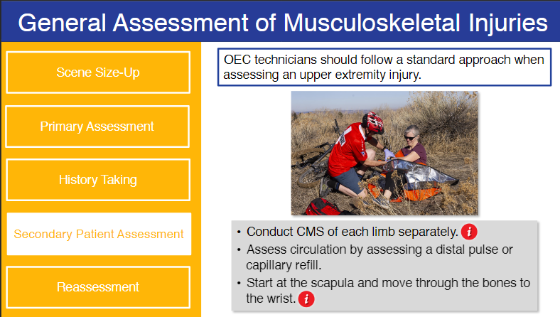   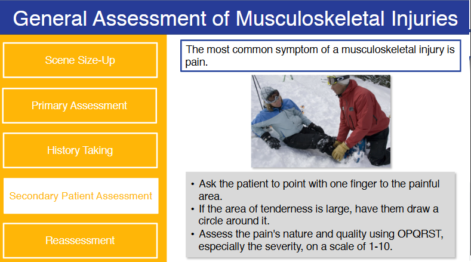   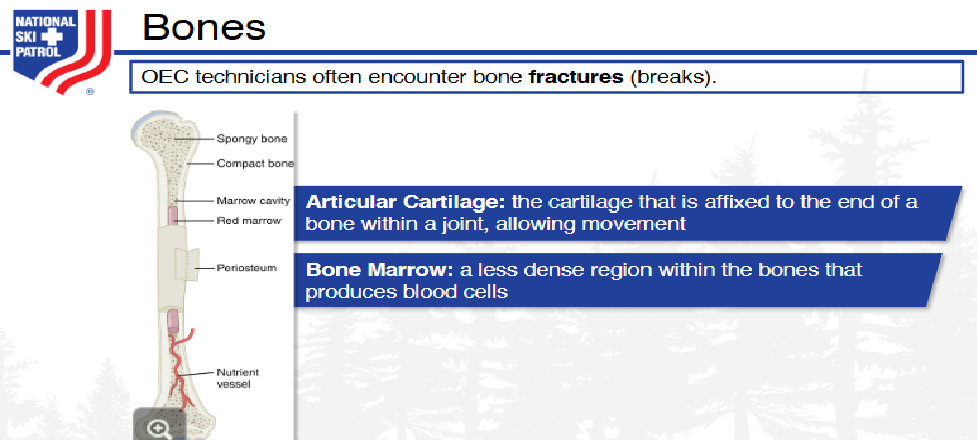   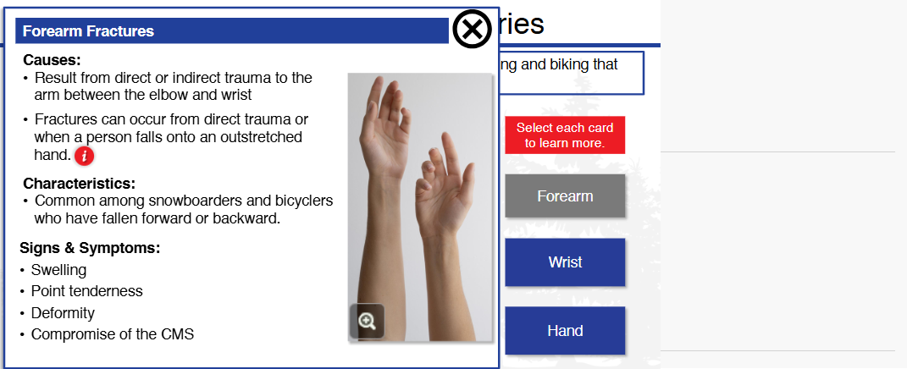   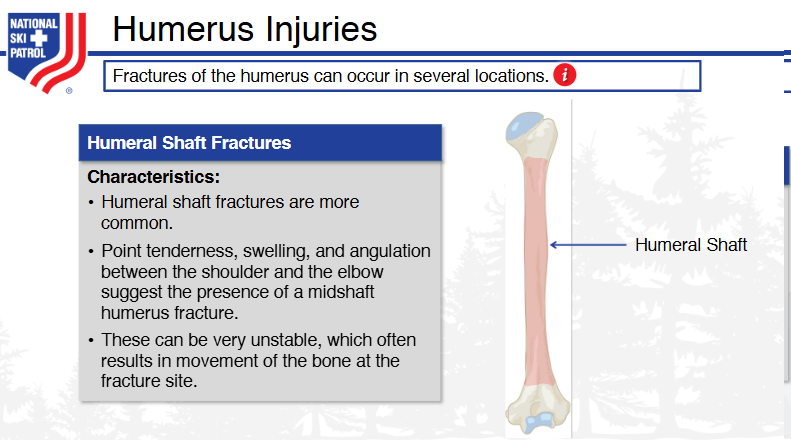   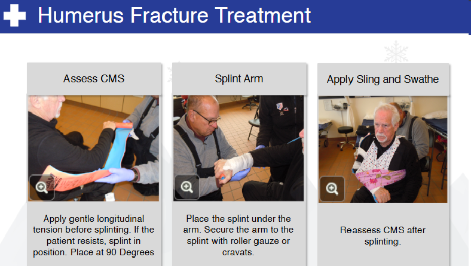   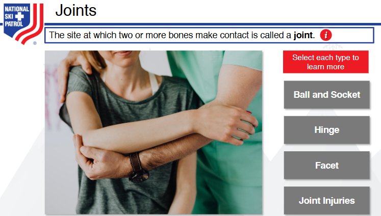   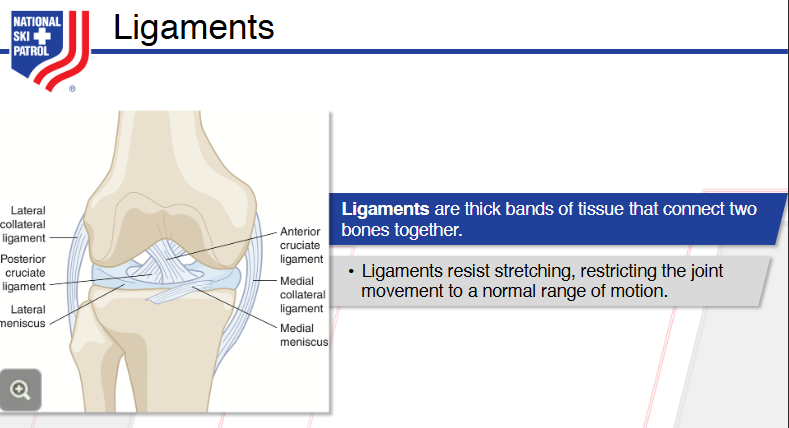   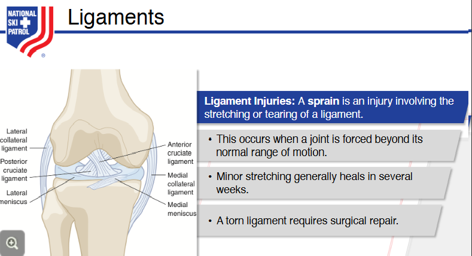   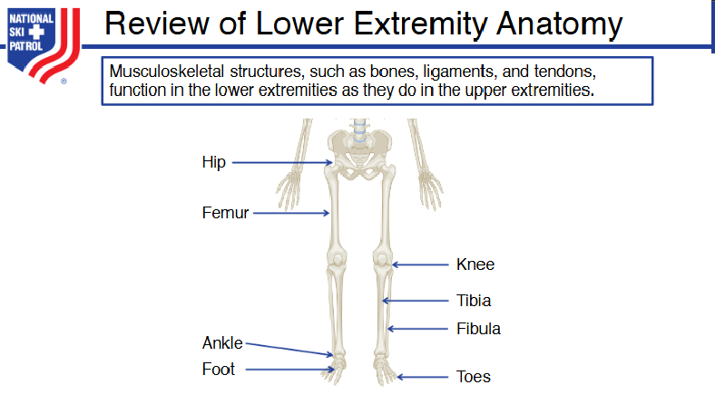   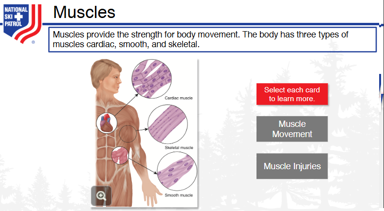      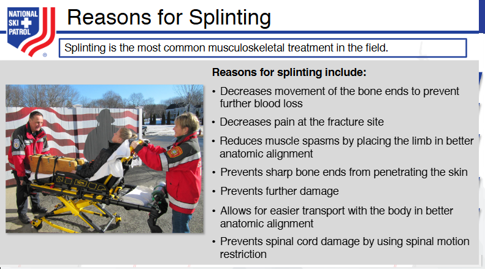   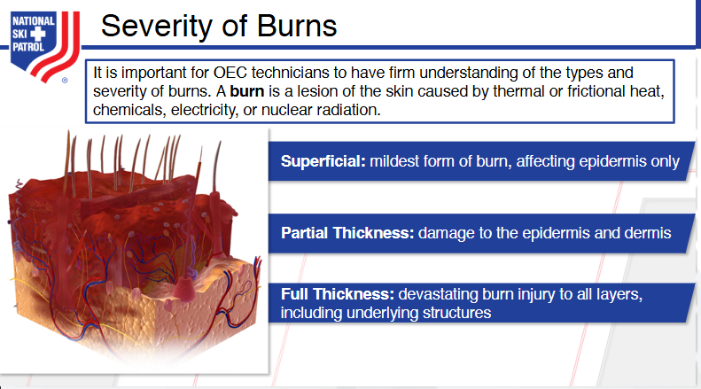   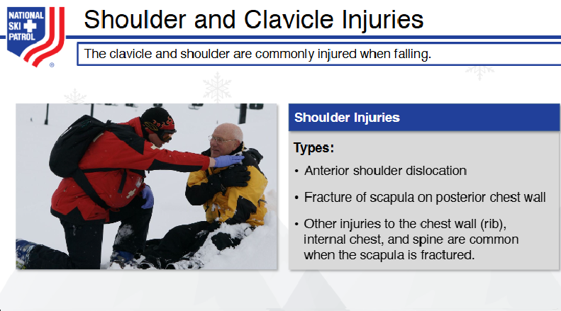   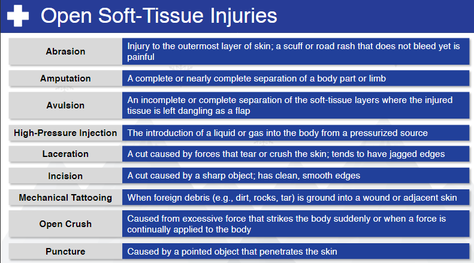   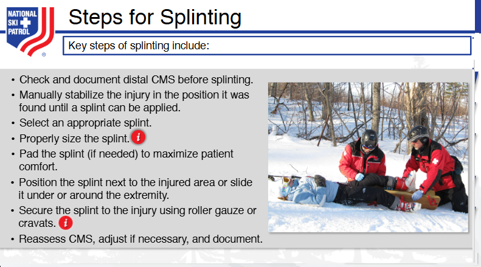   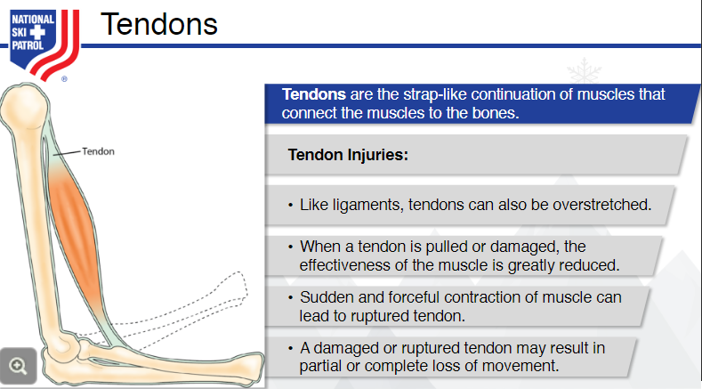   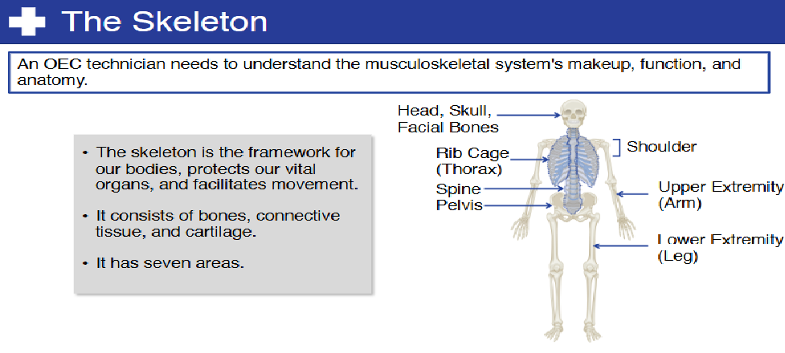   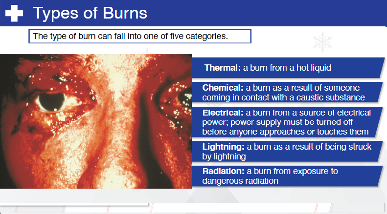   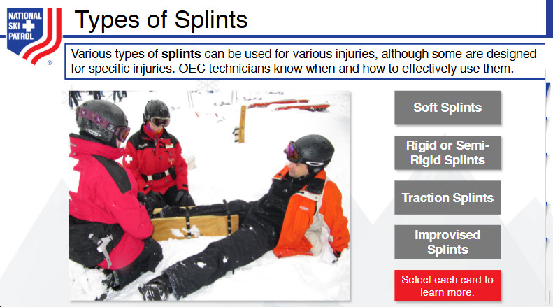      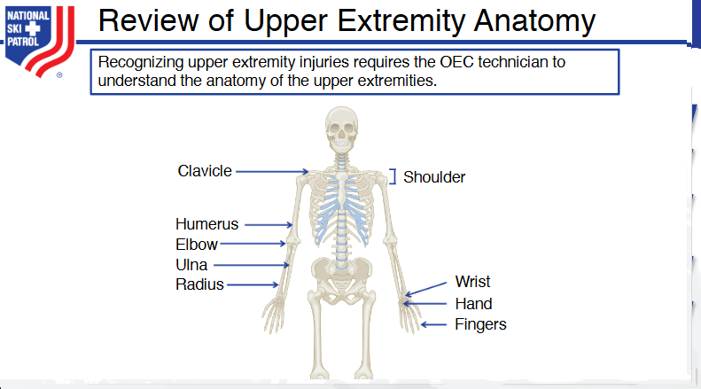   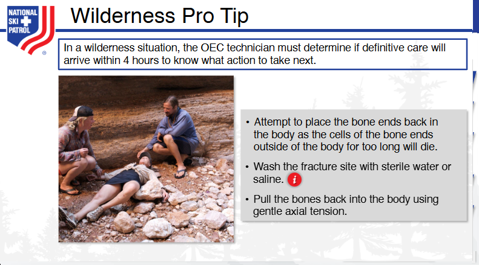   
    

## Github https://github.com/JoeEberle/ - Email  josepheberle@outlook.com 
    

    